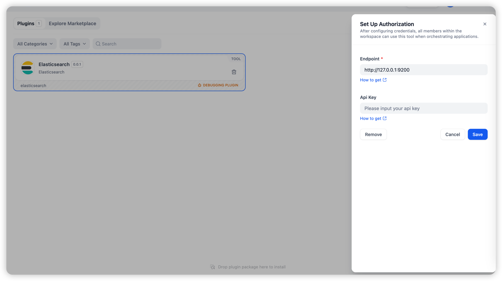
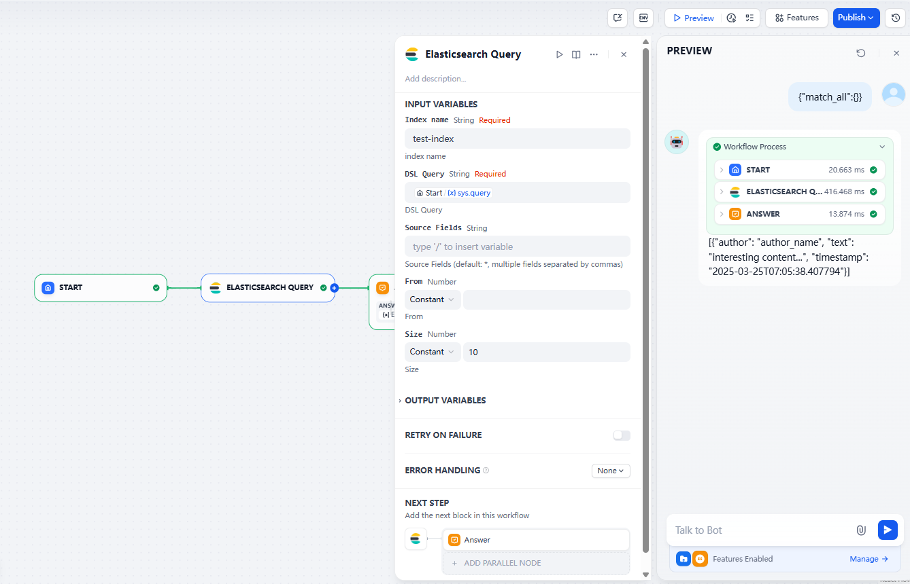

## Elasticsearch

**Author:** [quicksandzn](https://github.com/quicksandznzn)
**Version:** 0.0.1
**Type:** tool

### Description

This plugin is used to search for data in Elasticsearch.

### Usage

- Set Up Authorization

- Example

