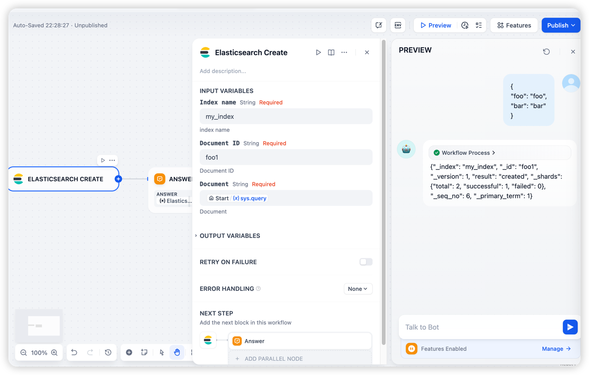

## Elasticsearch

fork from [dify-plugin-elasticsearch](https://github.com/quicksandznzn/dify-plugin-elasticsearch)
- **Version:** 0.0.6
- **Type:** tool

### Description

This plugin is used to search for data in Elasticsearch.

- feat: support full dsl body  
if fill body will use body to search  
why: to support `sort` and `size` control by llm
- refactor: result.text ensure_ascii=False

### Usage

- Set Up Authorization

- Query Example

- Create Example:

