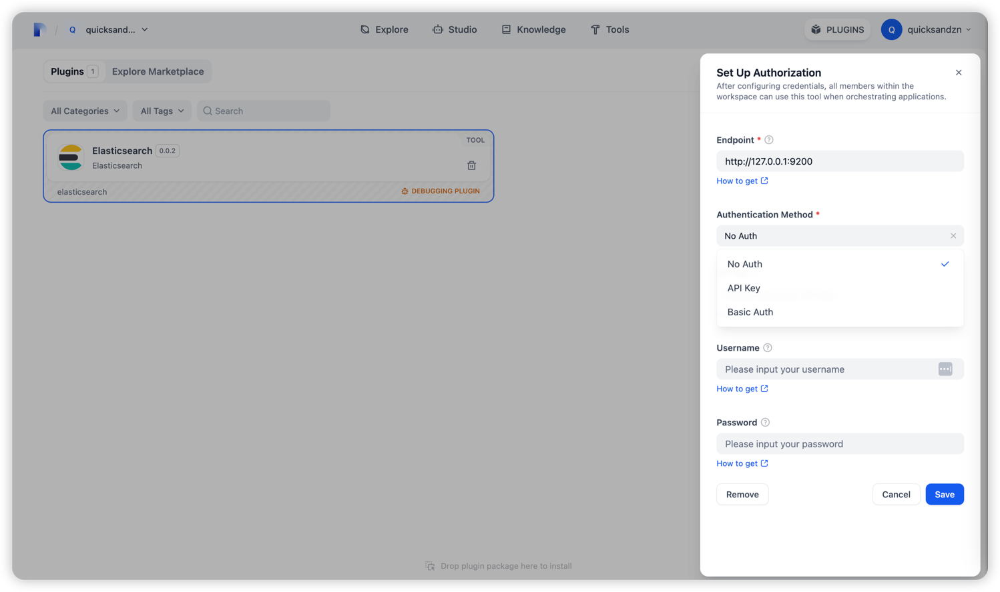

## Elasticsearch

- **Author:** [quicksandzn](https://github.com/quicksandznzn)
- **Github:** https://github.com/quicksandznzn/dify-plugin-elasticsearch
- **Version:** 0.0.4
- **Type:** tool

### Description

This plugin is used to search for data in Elasticsearch.

### Usage

- Set Up Authorization

- Query Example

- Create Example:

